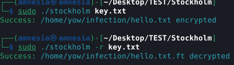
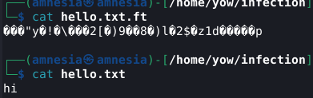

# Stockholm simple ransomware

This mini ransomware uses the same extension as the famous wannacry and uses the sodium library to encrypt files located in **/home/yow/infection**.

## Data Encryption

This project utilizes `crypto_secretstream_xchacha20poly1305` from the **libsodium** library for encrypting and decrypting data. This mechanism provides robust protection by combining XChaCha20 encryption with Poly1305 authentication.

### Encryption Format

The data is organized into a structured stream that includes:

- **Header**: Contains information about the stream and the key used.
- **Nonce**: A unique number used for each encryption operation to ensure that the same plaintext encrypted multiple times produces different ciphertexts.
- **Encrypted Data**: The actual data, which is protected by encryption.
- **Tag**: Indicates the type of message (e.g., regular message or rekeying request).

### Security

- **Unique Nonce**: Each nonce must be unique for every encryption session to ensure data security.
- **Key Protection**: Encryption keys should be carefully managed to prevent unauthorized access.

This mechanism ensures that your data is not only encrypted but also authenticated, thereby guaranteeing its integrity.


## Installation

**Download libsodium**
```
https://download.libsodium.org/libsodium/releases/
```

```
./configure
make && make check
sudo make install
```

```
gcc -lbsd stockholm.c -lsodium
```

## Examples



